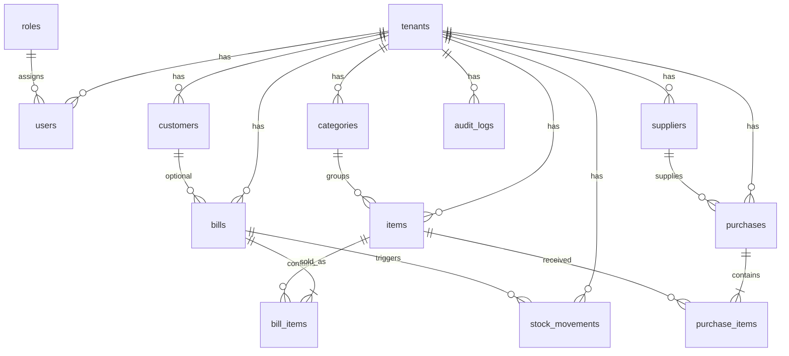
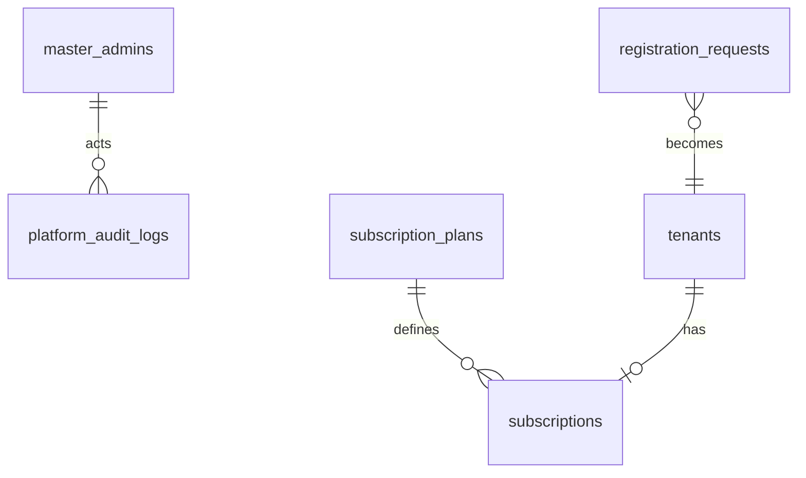

# System ERD (high level)

## Platform (no tenant ownership)

See also: [02-tenant-erd.md](./02-tenant-erd.md), [03-billing-erd.md](./03-billing-erd.md), [04-inventory-erd.md](./04-inventory-erd.md), [06-hotel-erd.md](./06-hotel-erd.md), [07-cafe-erd.md](./07-cafe-erd.md)
