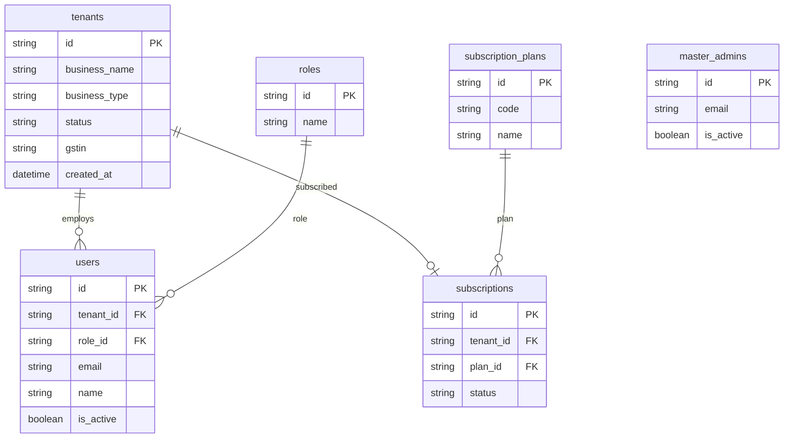

# Tenant & Authentication ERD

## Isolation rule

Every query on `users`, `customers`, `items`, `bills`, etc. must include **`tenant_id = JWT tenant`**.

Master admin routes use `master_admins` and may read cross-tenant **`tenants`** for SaaS operations only.
