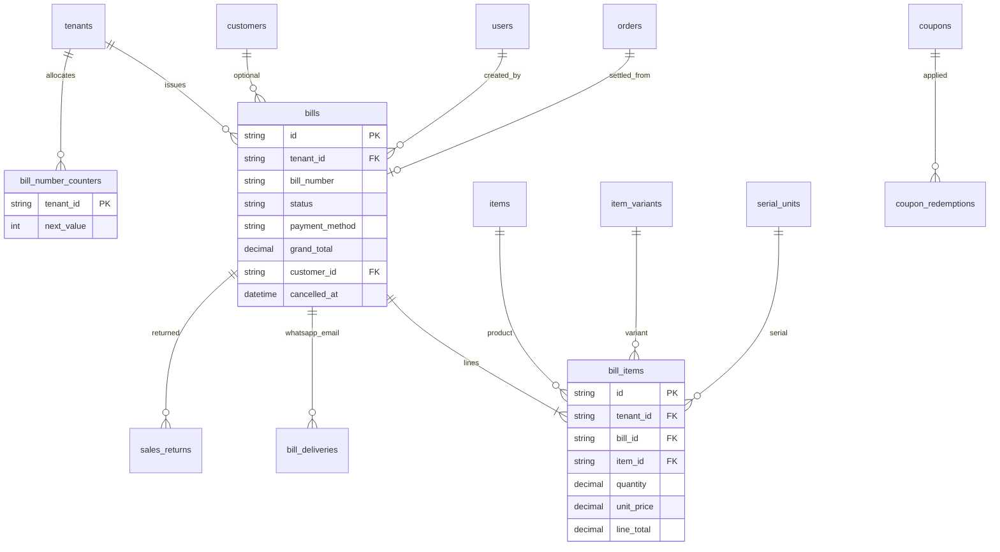

# Core Billing ERD

## Bill creation flow (atomic transaction)

1. Lock `bill_number_counters` (`FOR UPDATE`)
2. Insert `bills` + `bill_items`
3. Deduct stock / serial / recipe ingredients
4. Insert `stock_movements`
5. Post credit to `customers.balance` if payment_method = credit
6. Insert `audit_logs`
7. `COMMIT`

Service: `BillService.create_bill()`

## Financial integrity

Totals computed in service layer before persist. Cancelled bills retain rows; status → `CANCELLED`.
