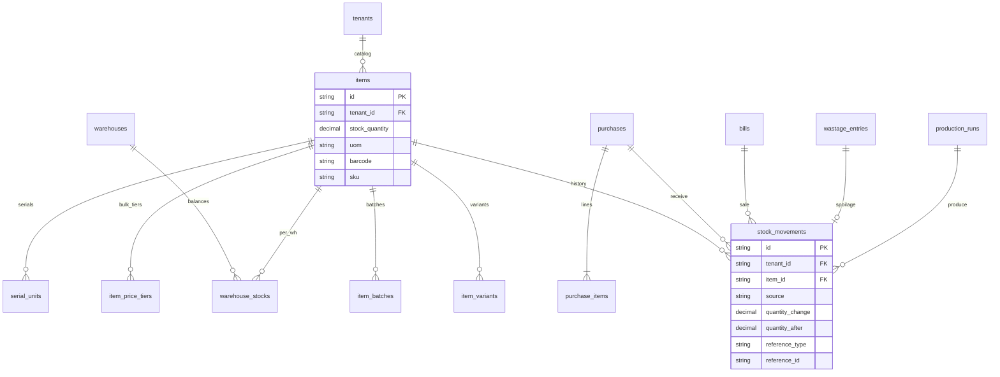

# Inventory ERD

## Stock timing

| Event | Stock change |
|-------|----------------|
| Purchase finalized | **+** quantity |
| Bill finalized (POS) | **−** quantity |
| Order settled (restaurant) | **−** via bill |
| Sales return approved | **+** quantity |
| Wastage recorded | **−** quantity |
| Production run | **−** ingredients, **+** finished goods |
| Recipe on bill | **−** ingredient items via `RecipeStockService` |

Concurrent updates use row locks on `items` (`ItemRepository.lock_for_update`).
