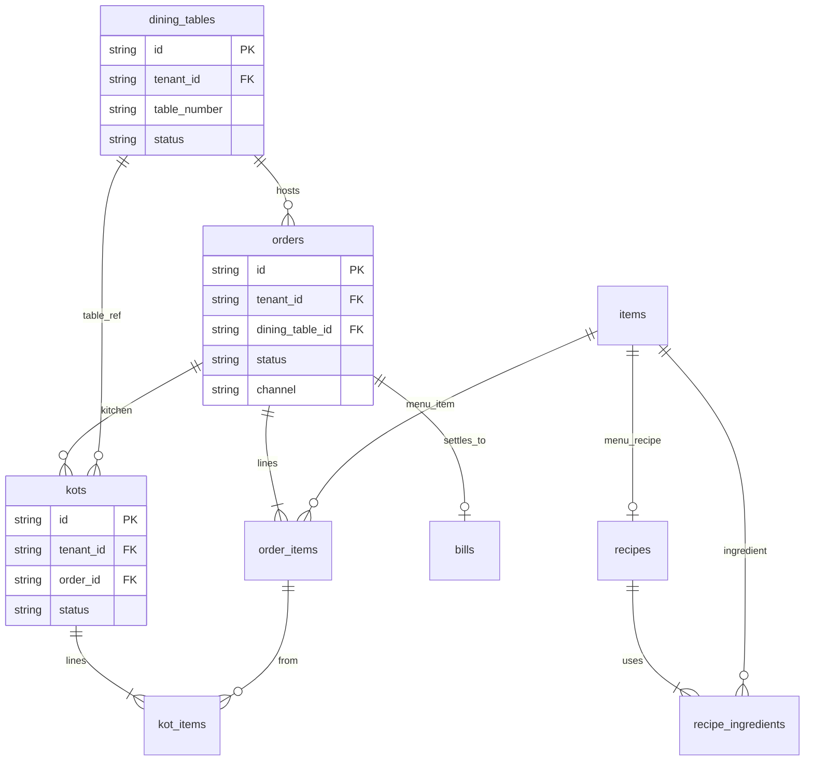

# Hotel / Restaurant ERD



## Flow

```
Table (FREE) → Open Order → Add OrderItems → Print KOT → Kitchen updates status
           → Settle Order → Bill → Payment → Table FREE
           → Stock/recipe deduction on bill
```

Table **`orders`** here is **restaurant POS orders**, not wholesale **`sales_orders`**.
