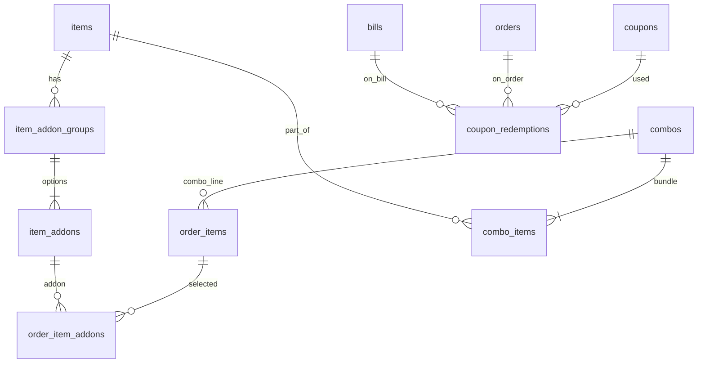

# Cafe ERD (extends Hotel)

Cafe reuses hotel floor/KOT tables and adds promotional catalog structures.

## Cafe vs Hotel

| Feature | Hotel | Cafe |
|---------|-------|------|
| Tables/KOT | Yes | Yes |
| Service charge | Yes | No (module) |
| Add-ons/Combos | No | Yes |
| Coupons | No | Yes |
| Recipes/Wastage | Yes | Yes |

Same **`orders`** / **`bills`** tables — module gates control UI/API visibility.
