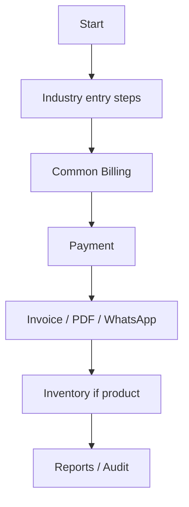

# Cafes / Tea Shops — Workflow

## Primary flow

```
Customer
  → Menu / Quick Select
  → Add-ons / Combo (optional)
  → Billing
  → Payment
  → Invoice
  → Stock Deduction
  → Sales Report
```

## Notes

- Tenant isolation applies at every step.
- Product stock movements use the **common inventory engine** when lines are PRODUCT.
- Service-oriented steps (especially Travel) may skip stock deduction.
- Payments/invoices reuse the **common billing engine**.

## Mermaid


