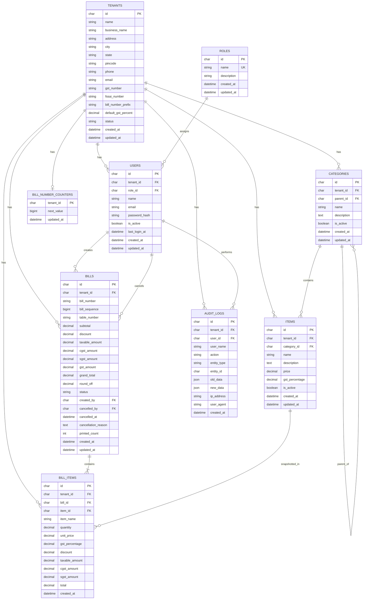

# 08 — Database ERD

## Entity Relationship Diagram



## Cardinality Summary

| Relationship | Cardinality |
|--------------|-------------|
| Tenant → Users | 1:N |
| Tenant → Categories | 1:N |
| Tenant → Items | 1:N |
| Tenant → Bills | 1:N |
| Category → Items | 1:N |
| Category → Category (parent) | 1:N optional |
| Bill → Bill Items | 1:N |
| User → Bills (created_by) | 1:N |
| Item → Bill Items | 1:N (historical; snapshot stored) |
| Tenant → Audit Logs | 1:N |

## Unique Constraints

```text
roles.name
users (tenant_id, email)
bills (tenant_id, bill_number)
bills (tenant_id, bill_sequence)
categories (tenant_id, parent_id, name)  -- recommended
```

## Isolation Key

Every tenant-scoped FK path is guarded by matching `tenant_id` in application queries. Prefer storing `tenant_id` on child tables (`bill_items`, `audit_logs`) to avoid accidental cross-tenant joins.
