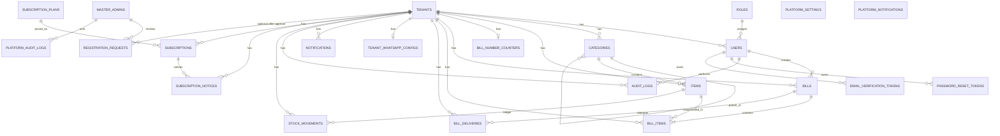

# 08 — Database ERD

**Current model:** 23 application tables in `backend/sql/02_schema.sql`.  
Text map + cascades: [database-relationships.md](./database-relationships.md).

## Entity Relationship Diagram

## Cardinality notes

| From | To | Cardinality |
|------|-----|-------------|
| Tenant | Users / categories / items / bills | 1 : N |
| Category | Child categories | 1 : N (self) |
| Bill | Bill items | 1 : N (required lines) |
| Tenant | WhatsApp config / bill counter | 1 : 0..1 |
| Tenant | Subscription (current) | 1 : 0..N historically; app uses current row |
| Master Admin | Registration / platform audit | 1 : N |
| Plan | Subscriptions | 1 : N (`plan_id` nullable SET NULL) |

## Platform vs tenant

- **Tenant-scoped:** everything under a business (billing, catalog, stock, tenant audit).  
- **Platform:** `master_admins`, `platform_settings`, `subscription_plans`, `platform_notifications`, `platform_audit_logs`.  
- **Bridge:** `registration_requests`, `subscriptions`, `subscription_notices`.

## Attribute highlights (not exhaustive)

| Entity | Notable fields |
|--------|----------------|
| TENANTS | `business_type`, `status` ACTIVE\|SUSPENDED |
| USERS | `token_version`, email verify / pending email |
| CATEGORIES | generated `parent_key` for root uniqueness |
| ITEMS | `sku`, `cost_price`, `stock_quantity` |
| BILLS | `payment_method`, `table_number` (= reference) |
| MASTER_ADMINS | no `tenant_id` |
| SUBSCRIPTIONS | `price_at_purchase`, trial/paid ends, status |

Full columns: [07-database-design.md](./07-database-design.md).
