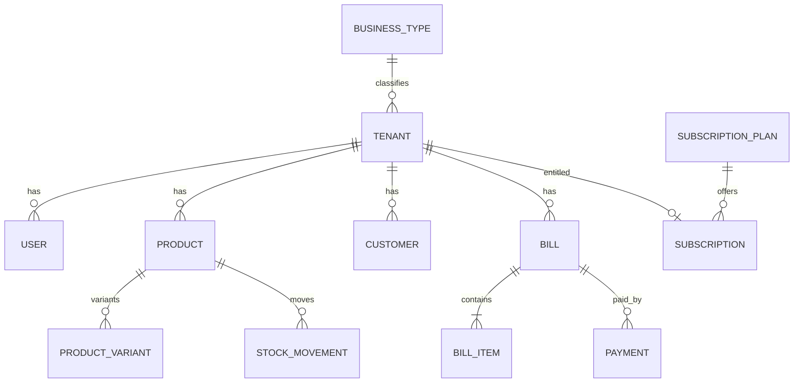

# Database Relationships — Prabha Billing SaaS V2

> **Conceptual target** for V2.  
> **Live production** still uses the 23-table schema documented in [07-database-design.md](./07-database-design.md) and the operational notes below.  
> No migrations in the documentation phase.

---

## A. Implemented baseline (today)

See current ER sketch and cascades in the Phase 8 model:

- Tenant → users, categories, items, bills, bill_items, stock_movements, notifications, audit_logs, …  
- Platform: master_admins, registration_requests, subscription_plans, subscriptions, platform_audit_logs, …  
- Category uniqueness via generated `parent_key`  
- Greenfield: `backend/sql/02_schema.sql` · Live upgrade: helpers + `stamp_alembic_head.py`

Full column catalog: [07-database-design.md](./07-database-design.md).

---

## B. Target relationship map (V2)

```
MasterAdmin
PlatformSettings
SubscriptionPlan ──< Subscription >── Tenant
Module / Feature / BusinessType ──< BusinessTypeModule >
Tenant ── BusinessType
Tenant ──< User >── Role ──< RolePermission >── Permission
Tenant ──< Customer | Supplier | Category | Product | Service | Expense >
Product ──< ProductVariant >── Unit / Brand / BatchLot / SerialUnit
Tenant ──< Warehouse >── StockBalance / StockTransfer
Tenant ──< Bill >── BillItem (PRODUCT|SERVICE)
Bill ──< Payment | BillReturn >
Tenant ──< PurchaseOrder >── PurchaseItem
Restaurant: Tenant ──< RestaurantTable >── Order ── KOT ── Kitchen
Travel: Tenant ──< TourPackage >── Booking ── Itinerary / Commission
```

---

## C. Cardinality (selected)

| From | To | Type | Notes |
|------|-----|------|-------|
| Tenant | User | 1:N | RESTRICT delete |
| Tenant | Bill | 1:N | Financial keep |
| Bill | BillItem | 1:N | Snapshots |
| Bill | Payment | 1:N | Partial allowed |
| Product | ProductVariant | 1:N | Clothing etc. |
| Product | SerialUnit | 1:N | IMEI unique per tenant |
| Product | BatchLot | 1:N | Expiry |
| BusinessType | Module | M:N | Via mapping |
| SubscriptionPlan | Subscription | 1:N | plan_id SET NULL ok |
| MasterAdmin | PlatformAuditLog | 1:N | actor SET NULL |

---

## D. Cascade policy (target)

| Pattern | ON DELETE |
|---------|-----------|
| tenant-owned → tenants | RESTRICT |
| bill_items.bill_id | RESTRICT |
| bill_items.product_id | SET NULL (snapshot remains) |
| auth tokens → users | CASCADE |
| subscription.plan_id | SET NULL |
| platform_audit.actor_id | SET NULL |

---

## E. Global vs tenant-specific

| Global | Tenant-specific |
|--------|-----------------|
| BusinessType, Module, Feature | Products, Customers, Bills |
| SubscriptionPlan | Inventory, Expenses, Users |
| MasterAdmin, PlatformSettings | Settings, Notifications, Audit |

---

## F. Mermaid (core commerce)



---

## G. Safety

Until an approved sprint:

- Do not CREATE/DROP V2 tables on live.  
- Do not delete production data.  
- Backup + inspect before any future migration.
